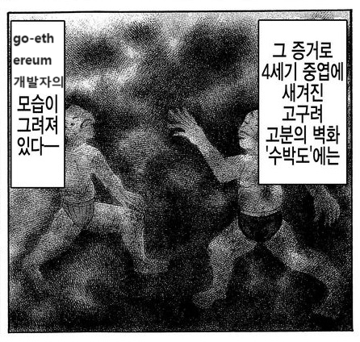

    <h1>go-ethereum은 유구한 역사를 지니고 있습니다.</h1>
    
    <h3>이 프로젝트는 go-ethereum 코드의 주석을 번역하고, 이해한 내용을 정리합니다.</h3>
    
2024년 1월 22일 시작, goerli 테스트넷에 덴쿤 업그레이드 적용 이후의 시점임을 알립니다.

    
개인적으로 진행하는 것이므로, 번역 지침은 따로 없습니다.

    <a href="https://github.com/piatoss3612/go-ethereum-breakdown">Github</a>

